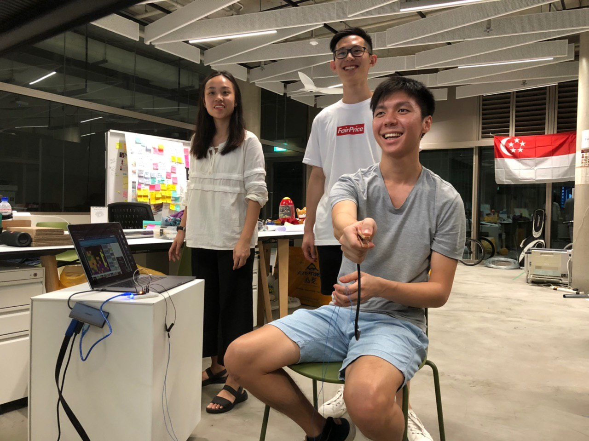
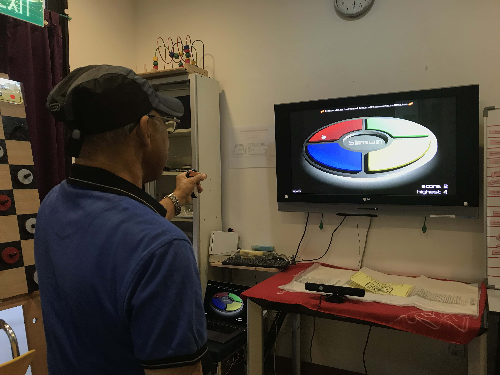

# Perry
Perry is made for a rehabilitation system to help stroke and Parkinson’s patients regain the use of shoulder reach and finger pinch abilities. It features a wireless ‘pinch’ controller that allows for users to play a list of curated games.

<figure>
  <figcaption><b>Perry Prototype Testing</b></figcaption>
  
</figure>

<figure>
  <figcaption><b>User Test at rehabilitation center</b></figcaption>
  
</figure>
